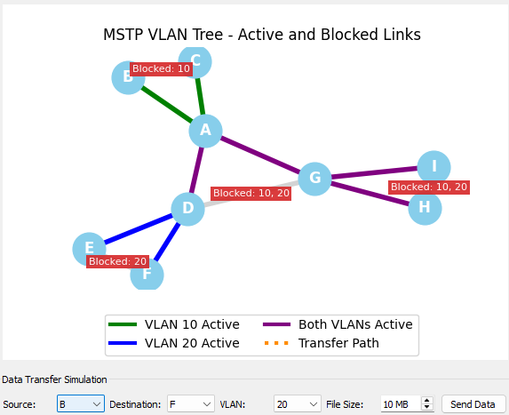

# MSTP VLAN Simulation

<div align="center">
  
</div>

This project is a hands-on simulation of a computer network using VLANs (Virtual Local Area Networks) and MSTP (Multiple Spanning Tree Protocol). It is designed as a learning tool to help you understand advanced networking concepts through visualization and experimentation.

## Why This Project Exists

In modern networks, we often need to separate different groups of devices for security or organizational purposes. Imagine an office building where you want the Sales team's computers to be on a different network from the Engineering team's, even if they are physically connected to the same hardware. This is what **VLANs** are for—they create separate "virtual" networks on the same physical equipment.

However, creating multiple paths between network switches for redundancy can lead to a problem called a "network loop," where data packets can get stuck circling forever, crashing the network. **Spanning Tree Protocol (STP)** is a technology that prevents these loops by intelligently blocking redundant paths. **MSTP** is an advanced version of STP that allows for better load balancing across different VLANs.

This project simulates this entire environment on your computer, allowing you to see how MSTP works to build a stable network topology and how data travels across different VLANs.

## Technology Used

This simulation is built with the following technologies:

- **Python:** The core programming language for the simulation logic.
- **Flask:** A lightweight web framework used to create a simple API for each network node, allowing them to communicate with each other.
- **PyQt5:** A set of Python bindings for the Qt application framework, used to create the desktop dashboard.
- **Matplotlib:** A plotting library used to draw the network graphs in the dashboard.
- **NetworkX:** A Python package for the creation, manipulation, and study of the structure, dynamics, and functions of complex networks.


## Getting Started

### 1. Prerequisites

- Python 3.7+
- `pip` (Python package installer)

### 2. Installation

Navigate to the project directory and install dependencies:

```bash
pip install -r requirements.txt
```

### 3. Configuration

Edit `config.py` to set IP addresses, port numbers, VLANs, and network topology.

- **Single Machine:** All nodes use `127.0.0.1` with different ports (default setup).
- **Multiple Machines:** Copy the project to each machine and update `Ip_address` in `config.py` to match each machine's real IP.

### 4. Running the Simulation

Open a terminal for each node and the dashboard. To start a node, use:

```bash
python main.py <NODE_ID>
```

Replace `<NODE_ID>` with the node's identifier (e.g., `A`, `B`, `C`).

To start the dashboard:

```bash
python run_dashboard.py
```

You will see a visual representation of the network. Use the dashboard controls to simulate data transfer and observe MSTP path selection.


## Restarting the Simulation

To restart all nodes and the dashboard, run:

```bash
python restart.py
```

This stops all running Python processes, restarts Node A, and launches the dashboard.


## Troubleshooting

If nodes cannot connect to each other:

1. **Check IP Addresses:** Ensure the IP addresses in `config.py` are correct.
2. **Firewalls:** Make sure your firewall is not blocking Python or Flask from communicating over the network.
3. **Network:** If running on multiple machines, ensure they are all connected to the same network.
